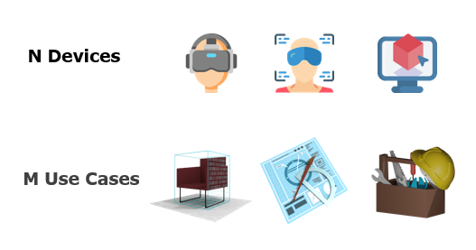
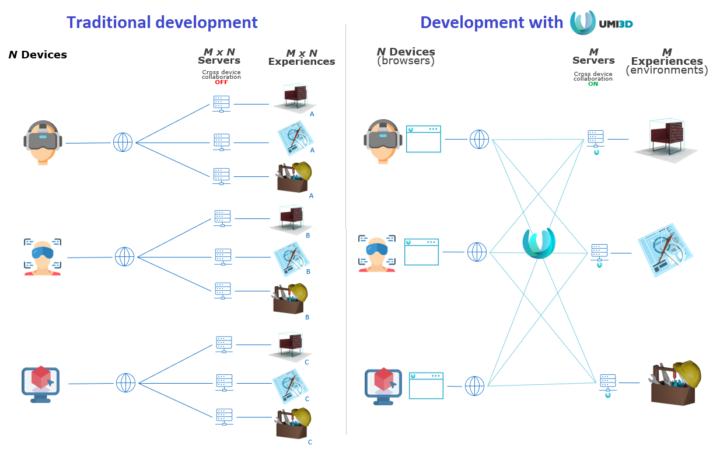
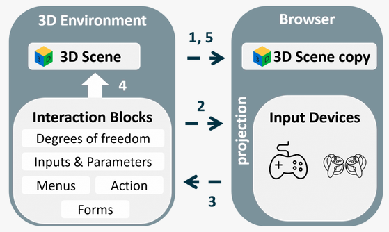

---
hide:
  - toc
---

# UMI3D SDK Documentation

{: .no-lightbox style="height:70%;width:70%"}
{: .no-lightbox style="height:70%;width:70%"}

[:material-download: Download last SDK release](https://github.com/UMI3D/UMI3D-SDK/releases/){ .md-button .md-button--primary }
[:material-github: View on GitHub](https://github.com/UMI3D/UMI3D-SDK/){ .md-button }

## UMI3D : Unified Model for Interactions in 3D

UMI3D is a web protocol that enables the creation of 3D media in which users of any AR/VR device can collaborate in real time. The 3D media is created once and hosted on a server or on a local computer. Any XR device can display and interact with it remotely thanks to a dedicated UMI3D browser.

Creating experiences with UMI3D helps to reduce the number of experiences that should be developed to treat the same use case with different devices. Moreover, it enables different devices to interact within a same experience without any further development.

## Principles

UMI3D relies on an interaction-based device abstraction layer. It allows remote 3D media created with the [UMI3D SDK](/External/Reference/UMI3D-SDK) to describe its possible interactions with a finite and limited set of objects.

Each UMI3D browser supervises the loading/synchronization of 3D content, as well as the dynamic generation of an adapted to the device user interface, allowing its user to perform the described interactions.
The main difference with existing cross-platform development standards such as WebVR or OpenXR is UMI3D's interaction-based device abstraction layer. These standards are limiting the designer to the usage of devices' common features. UMI3D enables to use all of the device's features to perform the interaction received.
