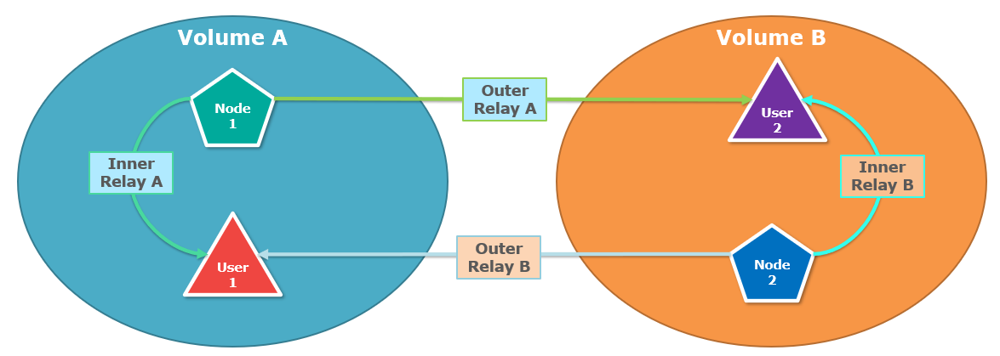
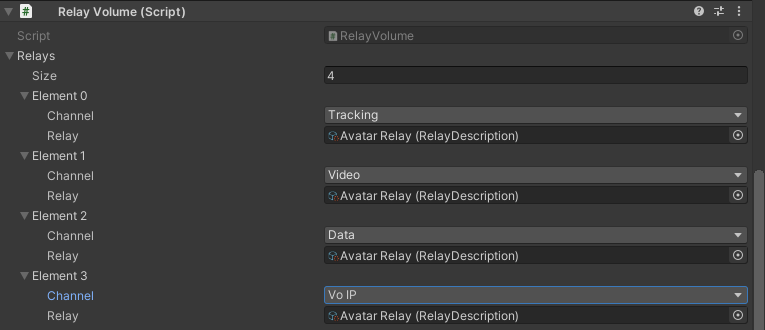

# Relays

## Relay description

A UMI3D Relay Description is a Scriptable Object allowing to describe custom rules governing the operation of the relay. Each description describes one rule for messages intended for inside its own Volume, and another for those intended for outside the Volume.

A rule first specifies if the relay should transmit data or ignore it.

If the relay has to send data, the definition of the sending strategy is required.

Three sending strategies are currently available:

- *Always Send* -> Each data may be always transmitted.
- *Fixed* -> Data may be transmitted regularly, at a defined frequency. The information that will be requested during a cooldown will be dropped.
- *Proximity* -> Data may be transmitted according to the distance between the transmitter and the receiver. This strategy requires the definition of the frequency and the spatial bounds. The information that will be requested during a cooldown will be dropped.

## Volumes

Volumes are defined by the usage of the component called "Relay Volume". It is then possible to specify for a data channel the Relay description to employ. 

Moreover, two properties have been added to the `UMI3DAbstractNode`. They are useful to know if a node is present in the same Volume as a connected user. In some cases, a node can be spatially present within a Volume, but use the relay of another Volume that has no spatial existence.

These fields must be specified by environment scripts, and can be modified at any time.

## Requests for relaying data

In order to request the sending of data on a specific data channel, the script RelayVolume makes available four methods, one per channel. A static dictionary is accessible to find a RelayVolume from an ID.

    sender -> The node associated to the request.
    data -> The data to send.
    target -> A specific UMI3DUser, which is not necessarily the receiver of the data.
    receiverSetting -> The setting used to determine the data receiver.
        All -> Every existing users.
        Others -> Every existing users, except the user specified in target.
        Target -> The user specified in target only.
    isReliable -> Determine if the network sending is reliable.
