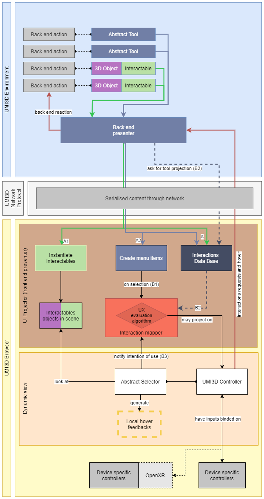

# Interaction model

The Interaction System enables user to interact with the 3D environment, enabling user changes in the environment.

## Model

The UMI3D interaction model  is divided into 5 key steps:

1. **Declaration**: The actions a user can process are declared dynamically in the environment.
    Those atomic interactions are called _interactions blocks_ and are grouped within _tools_.
    They are then sent to browsers.
2. **Selection**: When a _tool_ is selected by a user, the tool is _projected_ on the controller.
    This means that the interactions are then available with the adequate inputs on the controller.
    If a specific user interface is required, it is generated by the browser to handle the interaction.
3. **Interaction**: When interactions are performed with projected tools, browsers send different _Interaction Requests_ to notify the environment about the current user's actions.
4. **Reaction**: Receiving the request announcing the activation of an interaction block, the environment triggers feedbacks as a reaction.
    This enables the alteration of the environment through a _Manipulation_, the set up of a _Parameter_, the answer to a _Form_, or the triggering of an _Event_.
5. **Retroaction**: Finally, the reaction may change the available interactions for the users.

The complete list of supported Parameters and Interaction Requests can be found in the API reference.

## References

This model is based on the thesis that was the first step towards UMI3D:

- Julien Casarin, Dominique Bechmann, and Marilyn Keller. 2017. A unified model for interaction in 3D environment. In Proceedings of the 23rd ACM Symposium on Virtual Reality Software and Technology (VRST '17). Association for Computing Machinery, New York, NY, USA, Article 23, 1–7. [https://doi.org/10.1145/3139131.3139140](https://doi.org/10.1145/3139131.3139140)
- Julien Casarin, Nicolas Pacqueriaud, and Dominique Bechmann. 2018. UMI3D: A Unity3D Toolbox to Support CSCW Systems Properties in Generic 3D User Interfaces. Proc. ACM Hum.-Comput. Interact. 2, CSCW, Article 29 (November 2018), 20 pages. [https://doi.org/10.1145/3274298](https://doi.org/10.1145/3274298)