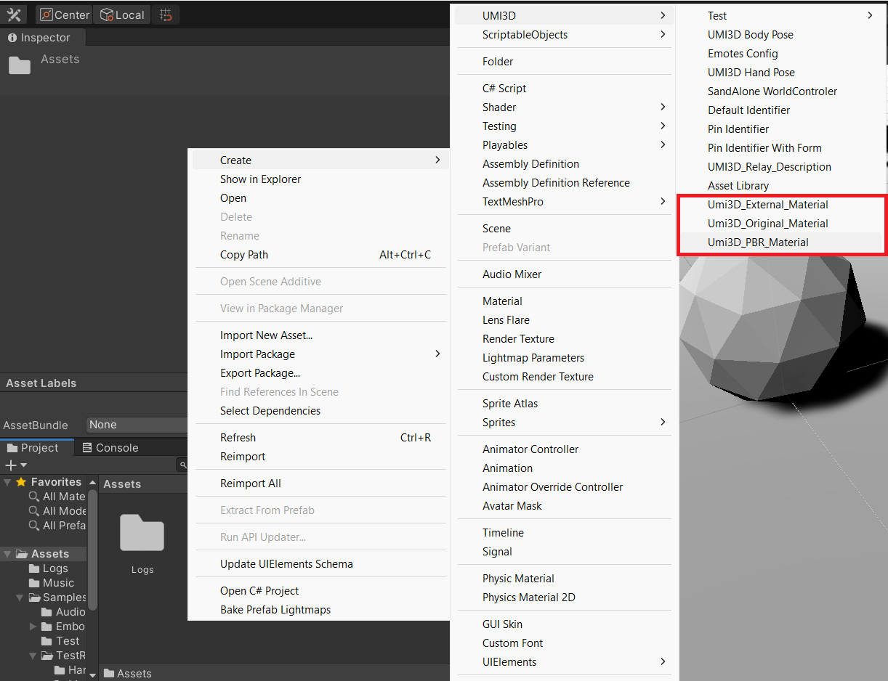
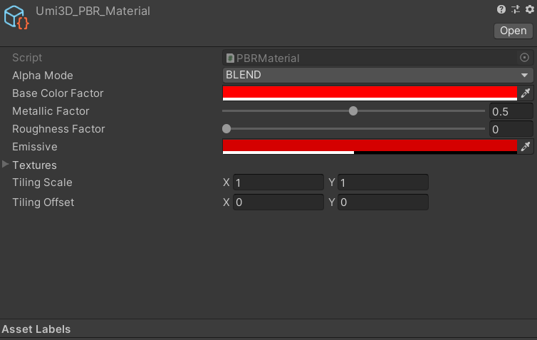
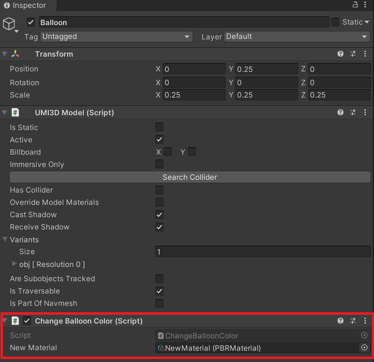

# Override the color of an asset

## Define a new Material

Create a Material Scriptable Object.



Such as a _Umi3D_External_Material_ or a _Umi3D_PBR_Material_.



## Change color by script

Create a script referencing the object and the material.



```cs
using umi3d.edk;
using UnityEngine;

public class ChangeBalloonColor : MonoBehaviour
{
    UMI3DModel balloonModel;

    public MaterialSO newMaterial;

    public void Start()
    {
        balloonModel = GetComponent<UMI3DModel>();
    }

}
```

## Override the material

Override the material by setting a new Material overrider to the object.

```cs
Operation op;
if (model.objectMaterialOverriders.GetValue().Count > 0)
    op = balloonModel.objectMaterialOverriders.SetValue(0, new MaterialOverrider() { overrideAllMaterial = true, newMaterial = newMaterial});
else
    op = balloonModel.objectMaterialOverriders.Add(new MaterialOverrider() { overrideAllMaterial = true, newMaterial = newMaterial});
```

## Perform transaction

```cs
Transaction t = new transaction()
{
    reliable = true
};
t.AddIfNotNull(op);
t.Dispatch();
```
