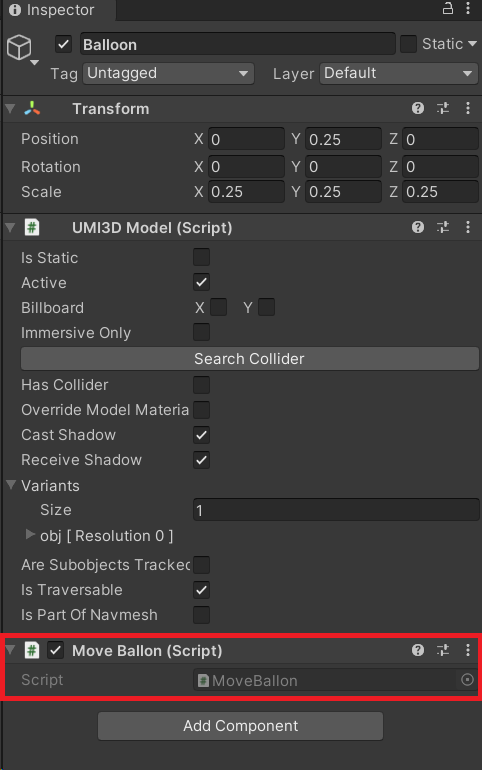

# Change an asset properties at runtime

Here is a short guide on how to change an asset properties. For example, we will move a 3D asset with a smooth movement using interpolation.

## Send the proper UMI3D operation

### 1. Create the script referencing the object

Add a script referencing the object to move



```cs
using umi3d.edk;
using UnityEngine;

public class MoveBallon : MonoBehaviour
{
    UMI3DNode balloonModel;

    public void Start()
    {
        balloonModel = GetComponent<UMI3DNode>();
    }
}
```

### 2. Define the Operation

Create a `SetValue` operation to move the object.

```cs
Vector3 newPosition = balloonModel.objectPosition.GetValue() + new Vector3(1, 0, 0);
SetEntityProperty operation = balloonModel.objectPosition.SetValue(newPosition);
```

### 3. Create the Transaction

Create a `Transaction`.

```cs
Transaction t = new Transaction()
{
   reliable = true
};

t.AddIfNotNull(operation);
```

### 4. Dispatch the transaction

Dispatch the transaction.

```cs
t.Dispatch();
```

## Activate interpolation on the property

```cs
StartInterpolationProperty operation = new StartInterpolationProperty()
{
    users = new HashSet<UMI3DUser>(UMI3DCollaborationServer.Collaboration.Users), //send the interpolation to all referenced users
    property = balloonModel.objectPosition.propertyId, // id of the property to activate interpolation on
    entityId = balloonModel.objectPosition.entityId,
    startValue = balloonModel.objectPosition.GetValue()
};

Transaction t = new Transaction()
{
    reliable = true
};

t.Add(operation);

t.Dispatch();
```
