# First steps with the UMI3D Environment Development Kit

This tutorial aims to help Unity developers to start creating Collaborative Virtual Environments with the UMI3D SDK. The created Collaborative Virtual Environment is a basic world only containing avatars for the users and one interaction.
For a more advanced sample, have a look on the [UMI3D Samples project](https://github.com/UMI3D/UMI3D-Samples).

!!! warning "Important"

    This tutorial is old and need to be updated.

!!! note "Requirements"

    - UMI3D Version: 1.1.r.210402+
    - Compatible UMI3D Desktop Browser: 1.0.5.210402+
    - Compatible UMI3D OpenVR Browser: 1.0.5.210402+

## Set up the server

### Add a server

Create an empty `GameObject` and eventually rename it “UMI3DServer”

 

Add a `UMI3DMainThreadDispatcher` component to the GameObject

 

Add a `UMI3DCollaborationServer` component to the GameObject

 

### Configure the server

Fill the HttpPort field (e.g. 50203) of the `UMI3DCollaborationServer` component

 

### Configure identification

Create an Identifier script and paste the code below inside.

```cs
using System.Collections;
using System.Collections.Generic;
using umi3d.common;
using umi3d.common.collaboration;
using umi3d.edk.collaboration;
using UnityEngine;

[CreateAssetMenu(fileName = "identifier", menuName = "UMI3D/Identifier")]
public class identifier : IdentifierApi
{
    public string pin = "0000";

    ///<inheritdoc/>
    public override UMI3DAuthenticator GetAuthenticator(ref AuthenticationType type)
    {
        return new UMI3DAuthenticator(pin);
    }
}
```

Create an `Identifier` asset in the Script folder

 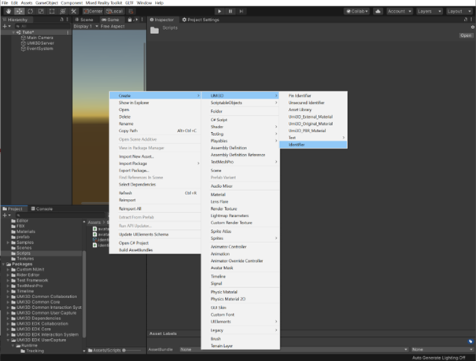

Assign the created Identifier to the Identifier field of the UMI3DCollaborationServer component

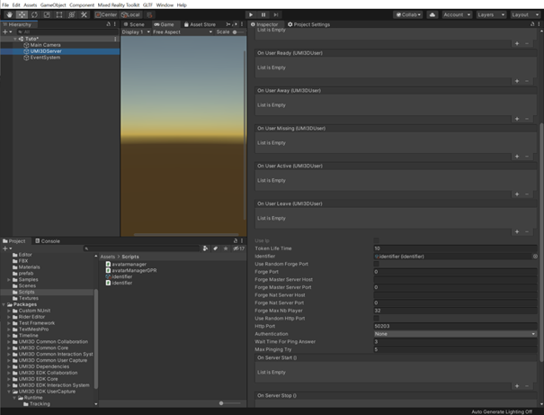

### Add a launcher

Create an empty `GameObject` and eventually rename it “UMI3DLauncher”


Add a `UMI3DLauncher` component to the GameObject


Tick the Launch Server On Start option


## Define an environment

### Create an environment

Create an empty `GameObject` and eventually rename it “UMI3DEnv”.


Add a `UMI3DCollaborationEnvironment` component to the GameObject

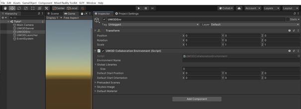

Fill the Environment Name field as wanted (testGPR in the screenshot)

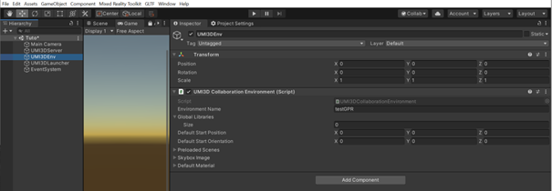

### Create a scene

Create an empty `GameObject` under the UMI3DEnv `GameObject` and eventually rename it “Scene”


Add a `UMI3DScene` component to this new `GameObject`

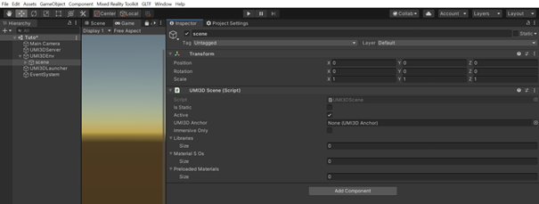

Create an empty `GameObject` under the UMI3DEnv GameObject and eventually rename it “SceneEmbo ”


Add a `UMI3DScene` component to this new `GameObject`

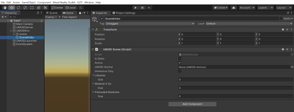

## Set up avatars

### Add a custom avatar

Create a empty `GameObject` and eventually rename it “Perso”

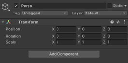

Add a `UMI3DModel` component to the GameObject

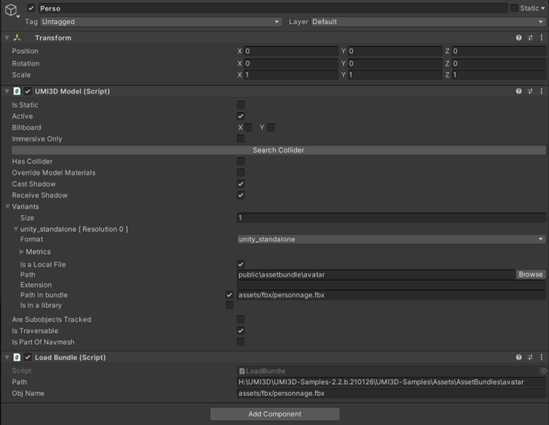

Set the size of Variants to 1, select Unity_standalone and add the path where the AssetBundle is. In order to have a visual representation of the avatar on the environment, I added the “LoadBundle” component.

Create a prefab of the whole asset in the Prefab folder and remove it from the scene.

### Configure user body tracking

Create an empty `GameObject` and eventually rename it “UMI3DEmboManager”


Add a `UMI3DEmbodimentManager` component to this new `GameObject`


Assign the `UMI3DScene` of the `GameObject` "SceneEmbo“ to the Embodiments Scene field of the `UMI3DEmbodimentManager` component


Create an AvatarManager script and paste the code below inside.

    ```cs
    using System.Collections;
    using System.Collections.Generic;
    using UnityEngine;
    using umi3d.edk;
    using umi3d.common.userCapture;
    using umi3d.edk.userCapture;
    using System;
    using umi3d.common;

    public class AvatarManager : MonoBehaviour
    {
        public GameObject modelPrefab;

        //Attacher un objet aux 
        static public Dictionary<String, GameObject> avtBones = new Dictionary<String, GameObject>();
        static public Dictionary<String, UMI3DModel> avtModele = new Dictionary<String, UMI3DModel>();
        static public Dictionary<UMI3DUserEmbodimentBone, UMI3DBinding> avtBind = new Dictionary<UMI3DUserEmbodimentBone, UMI3DBinding>();
        public List<bindList> listBindList = new List<bindList>();

        // Start is called before the first frame update
        void Start()
        {
            UMI3DEmbodimentManager.Instance.CreationEvent.AddListener(CreateBone);
            UMI3DEmbodimentManager.Instance.UpdateEvent.AddListener(UpdateBone);
            UMI3DEmbodimentManager.Instance.DeletionEvent.AddListener(DeleteBone);
            UMI3DEmbodimentManager.Instance.NewEmbodiment.AddListener(InstanciateEmbodiment);
        }

        protected void InstanciateEmbodiment(UMI3DAvatarNode AvatarNode)
        {
            GameObject go = GameObject.Instantiate(modelPrefab, AvatarNode.transform);
            go.transform.localPosition = new Vector3(0, -1.60f, 0);
            LoadEntity le = go.GetComponent<UMI3DModel>().GetLoadEntity();
            List<Operation> lop = new List<Operation>();
            lop.Add(le);
            avtModele.Add(AvatarNode.userId, go.GetComponent<UMI3DModel>());
            UMI3DServer.Dispatch(new Transaction() { Operations = lop, reliable = true });
        }

        protected void DeleteBone(UMI3DUserEmbodimentBone UserEmbodimentBone)
        {
            GameObject go = avtBones[UserEmbodimentBone.boneType];
            Destroy(go);
            avtBones.Remove(UserEmbodimentBone.boneType);
        }

        protected void UpdateBone(UMI3DUserEmbodimentBone UserEmbodimentBone)
        {
            GameObject go = avtBones[UserEmbodimentBone.boneType];
            go.transform.localPosition = UserEmbodimentBone.spatialPosition.localPosition;
            go.transform.localRotation = UserEmbodimentBone.spatialPosition.localRotation;
        }

        protected void CreateBone(UMI3DUserEmbodimentBone UserEmbodimentBone)
        {

            String id = UserEmbodimentBone.userId;
            UMI3DAvatarNode avnode = UMI3DEmbodimentManager.Instance.embodimentInstances[id];
            GameObject go = new GameObject("Bone:" + UserEmbodimentBone.boneType);
            go.transform.parent = avnode.transform;
            go.transform.localPosition = UserEmbodimentBone.spatialPosition.localPosition;
            go.transform.localRotation = UserEmbodimentBone.spatialPosition.localRotation;
            avtBones.Add(UserEmbodimentBone.boneType, go);
            bindList bl = listBindList[0];
            foreach (bind b in bl.bList)
            {
                UMI3DBinding binding = new UMI3DBinding()
                {
                    boneType = b.boneType,
                    rigName = b.rigName,
                    offsetRotation = Quaternion.Euler(b.rotationOffset),
                    offsetPosition = b.positionOffset,
                    node = avtModele[id]
                };

            }
        }

        // Update is called once per frame
        void Update()
        {

        }

        [System.Serializable]
        public class bind
        {
            [ConstStringEnum(typeof(BoneType))]
            public String boneType;
            public String rigName;
            public Vector3 positionOffset;
            public Vector3 rotationOffset;

        }
        [System.Serializable]
        public class bindList
        {
            public List<bind> bList = new List<bind>();
        }
    }
    ```

Add a `AvatarManager` component (with the created script) to the “UMI3DEmboManager” `GameObject`


Add the « X » prefab in the modelPrefab field of the AvatarManager component


Set the size of List Bind List to 1, the size of B List to 1, choose “head” as a BoneType and set the name of the corresponding Bone in the model's structure (“Head” in our case)

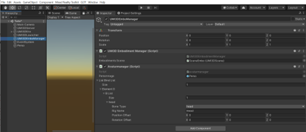

## Support audio

Create an empty `GameObject` and eventually name it “UMI3DAudio”


Add a `UMI3DAudioBridger` component to the `GameObject`


## Populate the scene with a 3D asset

Create an empty `GameObject` and eventually name it “obj1” under the “scene” `GameObject`

  

Add a `UMI3DModel` component to this new `GameObject`

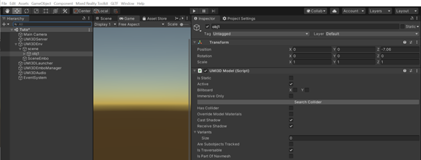

Select the path of the object, its format and its extension in the corresponding fields

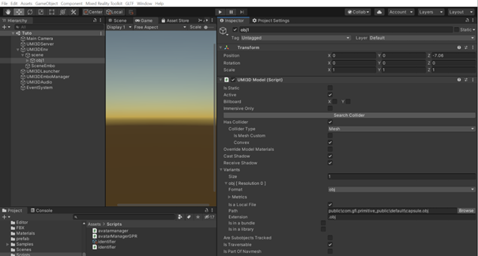

## Enrich the experience with interactions

Add a `UMI3DEvent` component to the “obj1” GameObject


Add a `StringParameter` component to the “obj1” GameObject

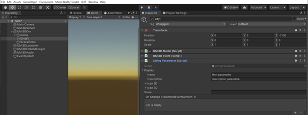

Add a `UMI3DInteractable` component to the “obj1” GameObject

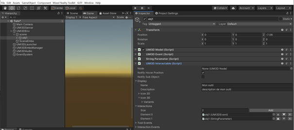

Add a `UMI3DManipulation` component to the “obj1” GameObject

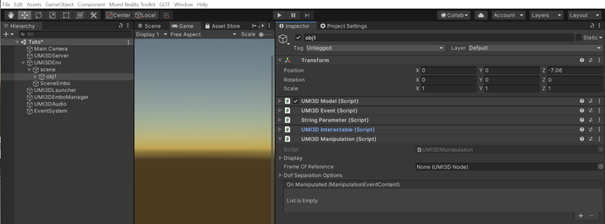
