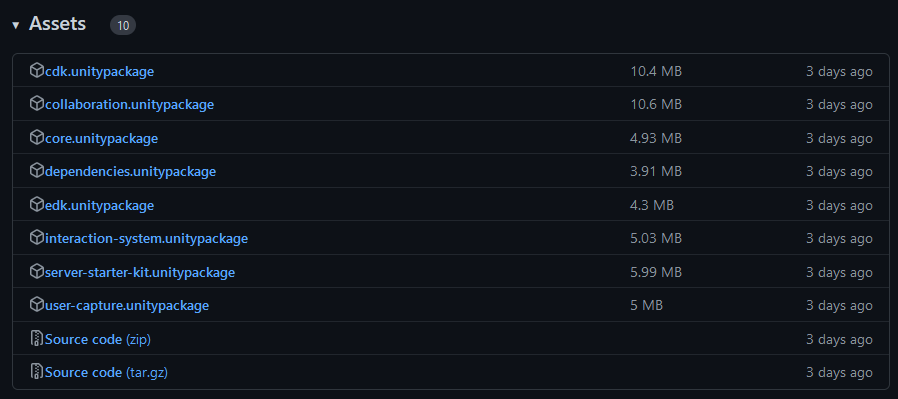

# First steps with the UMI3D Environments

## Install the UMI3D SDK

### Get Unity

Go on the [Unity website](https://store.unity.com/) and select a plan, then download a version compatible with the UMI3D release you want to use.

Create a new 3D project within Unity.

## Import the SDK

### 1. Get a UMI3D SDK release

Go on the [GitHub releases](https://github.com/UMI3D/UMI3D-SDK/releases) and find the release you want to use.

### 2. Download the packages

Under "Assets", download the packages files you want to use.
Note that the source code zips are not required to use UMI3D as thay are already integrated in the packages.



### 3. Import the packages

Drag and drop the file _edk.unitypackage_ in the Unity project window.

Also drag and drop the file _server-starter-kit.unitypackage_. It contains useful ready-to-use configuration to start a UMI3D server quickly.


And import everything.


??? info "Troubleshooting"

    ??? failure "Error: Multiple precompiled assemblies"

        On recent versions of Unity, you may run into an error like this:

        ```log
        Multiple precompiled assemblies with the same name Newtonsoft.Json.dll included on the current platform. Only one assembly with the same name is allowed per platform. (%USER%/My project/Library/PackageCache/com.unity.nuget.newtonsoft-json@3.0.2/Runtime/Newtonsoft.Json.dll)
        ```

        In that case, delete the NewtonSoft.Json.dll file located at `Assets/UMI3D SDK/Dependencies/UnityGLTF/Runtime/Plugins/net35/NewtonSoft.Json.dll`

    ??? failure "Error: Deterministic compilation failed"

        On recent versions of Unity, you may run into an error like this:

        ```log
        Assets\UMI3D SDK\Dependencies\Runtime\websocket-sharp-master\websocket-sharp\AssemblyInfo.cs(19,28): error CS8357: The specified version string contains wildcards, which are not compatible with determinism.
        ```

        In that case, go to the Edit>Project>Player settings tab, and disable "Deterministic compilation" under "Other settinggs/Script Compilation".

    ??? failure "Error: ComDomProvider could not be found"

        You may run into an error like this:

        ```log
        Assets\UMI3D SDK\Dependencies\Runtime\Forge\Editor\ForgeNetworkingEditor.cs(108,18): error CS1069: The type name 'CodeDomProvider' could not be found in the namespace 'System.CodeDom.Compiler'. This type has been forwarded to assembly 'System.CodeDom, Version=4.0.0.0, Culture=neutral, PublicKeyToken=cc7b13ffcd2ddd51' Consider adding a reference to that assembly.
        ```

        In that case, go to the Edit>Project>Player settings tab, and under "Other settinggs/Script Compilation" switch "Api Compatibility level" from ".Net Standard 2.0" to ".Net 4.x" ou ".Net Framework", and restart Unity.

## 
